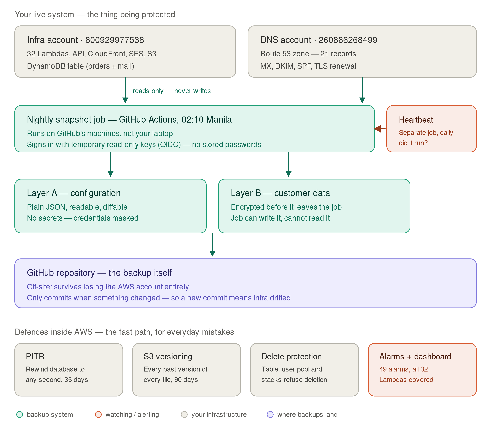

# Disaster recovery + CI/CD plan — KCMPS production

**Status: PLAN ONLY. Nothing in this document has been executed.**
Written 2026-08-13, after `kcmps.com` went live. Every fact in "Current state" below was
verified read-only against the live account (`600929977538`) and the DNS account
(`260866268499`) on that date — not assumed from the repo.

Two goals, in priority order:

1. **Never lose state that cannot be recreated** — DNS records above all, then the
   hand-built production config that exists only inside AWS.
2. **Make a bad deploy a 60-second revert instead of an incident** — for both `website/`
   syncs and Lambda deploys.

Hard constraint: **near-zero incremental cost.** Current AWS spend is effectively ₱0
(every service is under the ₱0.60 reporting threshold, all inside free tier). The design
below adds **₱0/mo** for the backup system itself and at most a few pesos for storage —
see "Cost" at the end. It deliberately avoids AWS Backup vaults, cross-region replication,
and anything with a per-resource monthly charge.

---

## 0. Architecture at a glance



*(Source: [`assets/kcmps-backup-architecture.svg`](assets/kcmps-backup-architecture.svg) —
edit the SVG, then re-render with
`convert -density 200 -background white kcmps-backup-architecture.svg kcmps-backup-architecture.png`.
Note ImageMagick silently drops SVG `<marker>` arrowheads, which is why the arrows in the
source are literal `<polygon>` triangles rather than markers.)*

**Two layers, protecting against two different kinds of bad day.** They are not redundant
with each other — each covers a failure the other cannot.

### The fast path — defences inside AWS

For everyday mistakes: something broke an hour ago and you need it back now.

| | Purpose | Why it exists |
|---|---|---|
| **DynamoDB PITR** | Restore the table to any second in the last 35 days | Already on. Covers the common case — a bad bulk write, a script that touched the wrong rows |
| **S3 versioning** | Every prior version of every object | The site bucket had it; **the raw-mail bucket did not**, so a delete there was permanent — and that bucket is the immutable source every mail feature derives from |
| **Deletion / termination protection** | Table, user pool and stacks refuse to be destroyed | Cheap insurance against a mistyped command or an over-eager cleanup |
| **Lifecycle rules** | Expire noncurrent versions at 90 days | Versions were unbounded on the site bucket. Also makes the rollback window explicit rather than accidental |

Fast, but they **live in the same account as the thing they protect**. Lose the account and
they go with it. That is the gap the second layer exists to fill.

### The slow path — the off-site backup

For the bad day AWS cannot help with: account compromised, closed, or a mistake that
propagates faster than anyone notices.

- **Layer A — configuration.** Plain, readable, diffable JSON of everything that existed
  *only* inside AWS. Deployed because none of it was written down anywhere: the Route 53
  zone (MX, DKIM, and the CNAME that silently renews TLS) had **zero backup of any kind**,
  and 64 Lambda environment maps existed nowhere but in AWS itself.
- **Layer B — customer data.** Encrypted before it leaves the runner. Deployed because PITR
  stops at 35 days and dies with the account. Encryption is asymmetric, so **the job can
  write a backup it cannot read** — a compromised runner or leaked token yields nothing.

### Why GitHub Actions, and not AWS

The pivotal choice. Three candidates, two disqualified on a single property each:

- **A Lambda inside AWS** — cannot back up the loss of the account it lives in.
- **Cron on the owner's laptop** — only runs when that laptop is awake. Not a backup.
- **GitHub Actions** — outside the blast radius, free at this volume, needs no stored AWS
  credential (OIDC), and lands the result somewhere already versioned.

The side effect turned out to matter as much as the intent: because the job commits **only
when something changed**, the backup history doubles as an infrastructure change log. Its
first real run caught an IAM policy created twenty minutes earlier.

### Why a separate heartbeat workflow

The failure that kills backup systems is not breaking loudly — it is **stopping quietly**.
No run, no error, no email, discovered months later. GitHub disables scheduled workflows in
repos idle for 60 days, which alone would have silently ended this.

It is a separate file on a separate schedule **on purpose**: a watchdog living inside the
workflow it watches gets disabled by the same event it exists to catch.

### Why the alarms and dashboard belong in this document

Same principle, different subject. DR is about surviving bad days, and an outage nobody is
told about is the worst version of one — see G11 below, where the entire mail pipeline was
unmonitored and its failure mode was silence.

---

## 1. Current state — what is and isn't protected

### Protected already (verified 2026-08-13)

| Thing | Protection | Notes |
|---|---|---|
| DynamoDB `kcmps` | PITR **enabled, 35 days** (earliest restorable 2026-07-28), **deletion protection ON**, PAY_PER_REQUEST | 144 items / 88 KB — the entire business's order+mail state is *tiny* |
| `kcmps-online-bucket-est-2026` (the live site) | Versioning **Enabled** — 223 current objects, 925 total versions | Every past deploy of every file is still there = free frontend rollback |
| `kcmps-payment-uploads-est-2026` | Versioning Enabled + lifecycle `expire-noncurrent-versions` @ 90d | |
| `kcmps-design-originals-est-2026` | Versioning Enabled | |
| Cognito pool `ap-southeast-1_LHJsFdCgo` | `DeletionProtection: ACTIVE`, 10 users | Defined in `kcmps-user-pool-v2.cfn.yaml` |
| SES | Production access ON, 50k/day, 14/s, bounce+complaint suppression on | |

### The real gaps — ranked by "how bad if it vanished tonight"

**G1 — Route 53 zone `Z06397161LBTJCRTPLL62` has no backup at all. 21 records.**
It lives in a *different* AWS account (`260866268499`) from everything else, is managed
by nobody and no template, and contains: the `A` records for `kcmps.com`/`www`/`site`, the
`dev` CNAME, **MX for `kcmps.com` and `mirror.kcmps.com`**, 6 DKIM CNAMEs, SPF/DMARC TXT,
the `_autodiscover` SRV, and the ACM validation CNAME
(`_bebe137c…`) that **silently renews the CloudFront certificate**. Losing this zone
breaks the storefront, all inbound and outbound mail, and — 13 months later, quietly —
TLS. There is no export anywhere. This is the single highest-blast-radius unbacked thing
in the business.

**G2 — 32 production Lambdas are CLI-managed with no versions and no aliases.**
`kcmps-create-order`, `kcmps-verify-payment`, `kcmps-send-mail-reply` and the rest all
publish to `$LATEST` only (`list-versions-by-function` → `$LATEST`; `list-aliases` →
empty). Consequence: **a bad `update-function-code` has no rollback.** Recovery today
means finding the previous commit, rebuilding the zip, and re-uploading — under pressure,
with the live checkout down. Separately, each function's **environment variables exist
only in AWS** and are recorded nowhere in the repo (e.g. `kcmps-create-order` carries
`TABLE_NAME`/`COGNITO_CLIENT_ID`/`COGNITO_USER_POOL_ID`/`FROM_EMAIL`/`UPLOADS_BUCKET`).
This is the same class of trap as `--metadata-directive REPLACE`: an
`update-function-configuration --environment` that omits a key silently drops it.

**G3 — the production HTTP API `6msg2uho6c` is CLI-built and unmanaged.**
30 routes, a JWT authorizer (`kcmps-cognito-jwt`), and one integration each. Stage is
`$default` with **`AutoDeploy: true`** — meaning a route or integration change is live the
instant it's made, with no staged deploy and no deployment history to roll back to.
Rebuilding this by hand from memory would be hours of archaeology.

**G4 — both CloudFront distributions are unmanaged, and one has a stale template.**
`EY6Q5RSWLDCEF` (kcmps.com/www/site) and `E7PDB5JQRZX0E` (dev.kcmps.com) exist, but
`aws cloudformation list-stacks` shows **no `kcmps-dev-domain` stack** — so
`storefront-infra/dev-domain.cfn.yaml` is either never-deployed or its stack was deleted,
and the repo template no longer describes reality. Two CloudFront Functions
(`kcmps-dev-basic-auth`, `site-kcmps-redirect`) are LIVE with their source only in AWS.

**G5 — the SES inbound relay is live and unmanaged.** Active rule set
`kcmps-mirror-inbound` → rule `mirror-single-recipient` (`shop@mirror.kcmps.com` → S3
`kcmps-inbound-mail-est-2026/inbound/`, ScanEnabled). `backend/infra/ses-relay.cfn.yaml`
exists in the repo but **has no deployed stack**. This one rule is the entire inbound mail
pipeline; there is exactly one of it and no second copy.

**G6 — `kcmps-inbound-mail-est-2026` has versioning OFF.** It holds the raw MIME
(50 objects, 2.4 MB) that is the immutable source of truth every mail feature derives
from — `deriveThreadId()`, the 2026-08-07 threading backfill, attachment extraction. A
delete here is permanent. It has a transition-to-IA lifecycle rule but no version safety.

**G7 — no termination protection on any CloudFormation stack.**
`kcmps-foundation` (the DynamoDB table + GSI1), `kcmps-user-pool-v2` (the user pool),
`kcmps-observability` (40 resources), `kcmps-backend-staging` (100 resources) all return
`EnableTerminationProtection: False`. Deletion protection on the table and pool means a
stack delete would *fail partway* rather than destroy data — but it would still leave a
half-dismantled stack.

**G8 — 13 IAM roles unmanaged**, including `kcmps-checkout-lambda-role`,
`kcmps-mail-lambda-role`, `kcmps-staff-api-lambda-role`, `kcmps-guardduty-malware-s3`.
Their inline policies were built incrementally by hand across many sessions (the
`mail-attachments-bucket` policy added 2026-08-08 is the most recent) and are recorded
only in prose in `backend/infra/README.md`.

**G9 — the live site bucket has no lifecycle rule.** 925 versions against 223 objects and
growing with every sync. Harmless today (23 MB total) but unbounded; it is also the only
bucket of the four without one.

**G11 — 15 of the 32 production Lambdas have no CloudWatch alarm.** Found 2026-08-13 while
reconciling a stale count in `backend/CLAUDE.md`, which claimed 37 alarms covered "all 17
deployed Lambdas". The alarm count is still exactly 37 and still covers exactly 17 functions
— the *Lambda* count grew to 32 and the alarm set never followed. Uncovered:

```
kcmps-ingest-inbound      kcmps-send-mail-reply     kcmps-get-mailboxes
kcmps-get-mail-message    kcmps-get-mail-messages   kcmps-mark-mail-read
kcmps-list-designs        kcmps-patch-design        kcmps-publish-design
kcmps-design-upload-url   kcmps-purge-archived-designs
kcmps-staff-pin           kcmps-set-order-tags      kcmps-dashboard-prefs
kcmps-create-manual-order
```

That is **the entire mail pipeline and the entire Asset Library, unmonitored.** A failing
`kcmps-ingest-inbound` would stop inbound customer mail arriving in the dashboard with
nothing paging anyone — the failure mode is silence, which is the hardest kind to notice.
`kcmps-send-mail-reply` failing means staff replies to customers silently don't send.

This is not strictly a *backup* gap, but it belongs here: DR is about surviving bad days, and
an outage nobody is told about is the worst version of one. Fix is additive and free —
extend `observability.cfn.yaml`'s alarm list to all 32 (CloudWatch alarms are ~₱2.50/alarm/mo
above the 10-alarm free tier, so +30 alarms ≈ ₱75/mo — **the one item in this document with a
real cost**, and worth stating explicitly under the governance rule; a cheaper variant is to
alarm only the ~6 functions whose silent failure is customer-visible).

**G10 — no CI/CD.** Every deploy is a hand-typed `aws s3 sync` or `aws lambda
update-function-code`. This repo already has two documented incidents caused by exactly
that: the `--metadata-directive REPLACE` outage and the staging-behind-production drift,
both on 2026-08-08.

---

## 1b. Repo ↔ deployed-infra reconciliation (checked 2026-08-13)

**Ground rule for everything below: the deployed AWS resources are the current state.
Where the repo disagrees, the repo is stale and needs updating — not the other way
around.** Nothing here should be "fixed" by changing AWS to match a document.

This matters for DR specifically: during an outage someone will reach for these files as
the recovery reference, and a template or a count that quietly stopped being true is how
a recovery goes wrong. Each item below is a **doc fix**, not an infra change.

### D1 — Lambda counts are wrong in three places. Actual: **32** in each environment.

Verified: 32 production Lambdas (`kcmps-*`), 32 staging (`kcmps-staging-*`), and the
`kcmps-backend-staging` stack manages all 32 of its own. Prod and staging are at **exact
name parity** — zero functions exist in one environment but not the other.

| File | Says | Actual |
|---|---|---|
| `CLAUDE.md:82` | "all 20 Lambdas + HTTP API…" | 32 |
| `CLAUDE.md:554` | "17 Lambdas + its own HTTP API" | 32 |
| `backend/infra/README.md:504` | "all 17 Lambdas were created by CLI" | 32 — and this is now doubly wrong, since staging's are CloudFormation-managed |
| `docs/roadmap.md:18` | "17 Lambdas, DynamoDB table, observability stack" | 32 |

Route counts, for the same reason: **30 routes** on each API (`6msg2uho6c` prod,
`162ufc121j` staging), not the 25 a quick paginated query reports — the AWS CLI paginates
at 25 and a naive `length()` silently returns only the first page. Worth noting in the
snapshot script too: **always unpaginate before counting**, or the backup itself will be
short by design.

### D2 — `kcmps-dev-domain` stack does not exist, but two files assert it does.

`CLAUDE.md:549` and `storefront-infra/CLAUDE.md:49` both describe `dev.kcmps.com` as
"stack `kcmps-dev-domain`, defined in `storefront-infra/dev-domain.cfn.yaml`".
`list-stacks` across every non-deleted status returns **no stack by that name**. The
distribution `E7PDB5JQRZX0E` is live and serving; it is simply not CloudFormation-managed.

Notably `dev-domain.cfn.yaml`'s own header is more honest than the CLAUDE.md files — it
says "once this stack exists", i.e. the template was written for a deploy that either
never happened or was later torn down. **Fix the two CLAUDE.md files to say "CLI-managed;
`dev-domain.cfn.yaml` is a reference template, not deployed"**, and treat the template as
Phase 3 import material rather than a description of reality.

This one is the most dangerous of the drifts: it would lead someone to run
`aws cloudformation deploy --stack-name kcmps-dev-domain` during a recovery, which would
**create a second distribution** rather than repair the existing one.

### D3 — `ses-relay.cfn.yaml` is correctly documented. No change needed.

Flagged here only so nobody "fixes" it. Its header already states plainly that the
resources were created via CLI on 2026-08-06 and that deploying the template against this
account will fail with "already exists". `backend/infra/README.md:1391` and `:1470` agree.
This is exactly the right pattern for every other drift above: **a template kept as
documentation, with a header saying so.**

### D4 — `backend/jobs/validate-upload-content.js` exists in the repo but is deployed nowhere.

No `kcmps-validate-upload-content` or staging equivalent exists. The file is a complete
handler addressing a real 2026-08-07 UAT finding (a JPEG renamed to `invoice.pdf` passes
`resolveUploadType()`, because both the declared Content-Type and the extension agree on a
renamed file — only the bytes can catch it). Its only inbound reference is a comment in
`backend/lib/magic-bytes.js:15`.

So this is **written-but-never-deployed work**, not drift in the strict sense — but a DR
snapshot would show 32 Lambdas against 33+ handlers in the repo, and the next person to
notice will waste time deciding whether something was lost. Add a `NOT DEPLOYED` line to
its header, and put it on the roadmap or delete it.

### D5 — `kcmps-observability` (40 resources) is absent from CLAUDE.md's key-files table.

37 CloudWatch alarms + an SNS topic + subscription + an SQS queue, deployed 2026-08-05.
`docs/roadmap.md:18` mentions "observability stack" in passing; the orientation table that
every session reads has no row for it, and `backend/infra/observability.cfn.yaml` therefore
has no entry point. Add a row.

### D6 — things the repo describes accurately (spot-checked, no action)

- Production Lambdas are CLI-managed, staging is CloudFormation — stated in `CLAUDE.md:82`,
  confirmed.
- Cognito pool ID / client ID / domain in `CLAUDE.md` match the deployed pool exactly.
- `MAIL_ALLOWED_RECIPIENTS` unset in production, set on staging — matches the documented
  asymmetry.
- The Route 53 two-account split, `Z06397161LBTJCRTPLL62` as the real zone, and
  `site.kcmps.com` redirecting via a CloudFront Function — all confirmed live.
- The 5 EventBridge crons match their documented schedules
  (`expire-pending-orders` 15m, `notify-unread-messages` 30m, `purge-archived-designs`
  15m, ×2 environments) plus 4 GuardDuty `DO-NOT-DELETE-*` rules.

### How this stops recurring

The Layer A snapshot below is also the fix for drift, not just for loss. Once the nightly
JSON is in git, **the counts stop being hand-maintained prose** — a doc claiming 17 Lambdas
can be checked against `infra-snapshots/lambda/` by anyone in two seconds, and a new
resource appearing in AWS shows up as a new file in a commit diff the next morning. Add one
step to the workflow: **when the snapshot diff shows a resource added or removed, update
the corresponding CLAUDE.md row in the same commit.**

Until that exists, the D1–D5 doc fixes above should be made by hand — they are cheap, and
each one is a recovery-time landmine removed.

---

## 2. The backup design

**Principle: for configuration, a git commit is a better backup than an AWS service.**
It costs nothing, it is diffable (so you can see *what* changed and *when*), it survives
loss of the AWS account itself, and it lives where the templates that recreate the infra
already live. AWS Backup vaults would cost real money to protect a 88 KB table.

So: **two layers, both automated, both ₱0.**

### Layer A — nightly config snapshot → committed to git

A single read-only script, `infra-snapshot.sh`, that dumps everything unrecreatable into
`infra-snapshots/` as pretty-printed, key-sorted JSON, then commits only if something
changed. Sorted + pretty so the daily diff is *semantic* — you can see "someone changed
`kcmps-verify-payment`'s `SES_SENDER`" as a two-line diff, which is a change-detection
system for free on top of the backup.

What it captures, mapped to the gaps above:

| File under `infra-snapshots/` | Command (all read-only) | Covers |
|---|---|---|
| `route53/kcmps.com.json` + `.zonefile.txt` | `list-resource-record-sets` (profile `default`) | **G1** |
| `lambda/<fn>.json` (×32) | `get-function-configuration` — env vars, role, timeout, memory, layers, runtime | **G2** |
| `apigw/6msg2uho6c.json` | `get-api` + `get-routes` + `get-integrations` + `get-authorizers` + `get-stages` | **G3** |
| `cloudfront/EY6Q5RSWLDCEF.json`, `E7PDB5JQRZX0E.json` | `get-distribution-config` | **G4** |
| `cloudfront/functions/*.js` | `get-function --stage LIVE` (actual source) | **G4** |
| `ses/receipt-rules.json`, `ses/identities.json` | `describe-active-receipt-rule-set`, `list-email-identities` + `get-email-identity` | **G5** |
| `iam/<role>.json` (×13) | `get-role` + `list-role-policies`/`get-role-policy` + attached managed ARNs | **G8** |
| `cognito/pool.json` | `describe-user-pool` + `describe-user-pool-client` + groups | belt-and-braces over the template |
| `dynamodb/kcmps.json` | `describe-table` + `describe-continuous-backups` | schema + confirms PITR is still on |
| `s3/<bucket>.json` | versioning + lifecycle + policy + public-access-block, per bucket | **G6/G9** drift detection |
| `eventbridge/rules.json` | `list-rules` + `list-targets-by-rule` | the 5 crons |

Two hard rules for this script, both learned in this repo:
- **Strictly read-only verbs only** (`get-*`, `list-*`, `describe-*`). It must never be
  possible for the backup system to change the thing it is backing up.
- **Redact nothing structural, but never commit secrets.** Lambda env vars here are
  identifiers (table names, pool IDs, bucket names, sender addresses) — no keys. The
  script should nonetheless run a deny-pattern scan (`SECRET|PASSWORD|TOKEN|_KEY$`) and
  **fail loudly rather than commit** if a future env var ever matches. The dev basic-auth
  CloudFront Function contains credentials — that one gets its auth string masked, with a
  note pointing at the password manager.

### Layer B — nightly data backup → committed to git

The `kcmps` table is **88 KB / 144 items**. That is small enough that the correct backup
is a full logical dump: `dynamodb scan` → `kcmps-data.json.gz` → commit. Roughly 15 KB
compressed per night, and git deduplicates the unchanged majority.

This gives what PITR cannot: **retention beyond 35 days, and survival of losing the AWS
account.** PITR stays on as the fast path (restore-to-timestamp in minutes, no code).
The git dump is the deep archive.

Revisit when the table passes ~50 MB — at that point switch this layer to
`export-table-to-point-in-time` into S3 Glacier Instant Retrieval and keep only the
*manifest* in git. Not needed for a long time at the current rate (144 items in 16 days).

`kcmps-inbound-mail-est-2026` (2.4 MB of raw MIME) is **not** committed to git — it's
customer mail content and doesn't belong in a source repo. It's covered instead by turning
on versioning (G6) plus a Glacier IR transition, which is pennies.

### Where the automation runs: GitHub Actions + OIDC

The repo is already on GitHub (`krdsystems/kcmps-application`). A scheduled workflow is
the right host because:

- **₱0.** Private-repo Actions minutes are free up to 2,000/mo; this job is ~40s/night ≈
  20 min/mo.
- **No long-lived credentials.** GitHub OIDC → a dedicated IAM role assumed for the
  duration of the run. No access key to leak or rotate. Critically, that role gets a
  **read-only policy** and nothing else.
- **It does not depend on the thing it protects.** A Lambda-based backup living in
  `600929977538` cannot back up the loss of `600929977538`. GitHub can.
- **It's the same substrate the CI/CD below needs**, so this is one setup, not two.

The DNS account (`260866268499`) needs its own small read-only role for the Route 53 dump —
consistent with the standing rule that agents never *write* to Route 53.

Local cron on the owner's laptop is explicitly rejected: a backup that only runs when a
particular machine is awake is not a backup.

**Failure must be loud.** A silent backup is worse than none, because it manufactures
false confidence. The workflow gets: (a) `continue-on-error: false` on every step, (b) a
final assertion that all expected files exist and are non-empty and that the record count
in the Route 53 dump is ≥ the last known count, and (c) GitHub's built-in failure email.
Add a weekly "heartbeat" run that fails if the newest snapshot commit is more than 48h old,
so a *silently disabled* schedule is also caught.

---

## 3. Restore procedures — write them before you need them

A backup nobody has restored is a hypothesis. Each of these goes in
`infra-snapshots/RESTORE.md` and gets **rehearsed once against staging**, where a mistake
is free.

| Scenario | Procedure | Target time |
|---|---|---|
| A DNS record was wrong/deleted | Diff `route53/kcmps.com.json` against live; hand the owner the exact `change-resource-record-sets` JSON. **Agents never apply this** — owner executes. | 15 min |
| Bad Lambda deploy | `aws lambda update-alias --name live --function-version <previous>` — see CI/CD phase 2 below. Until aliases exist: rebuild zip from the previous git tag. | 60s (after phase 2) |
| Bad frontend deploy | `git revert` + re-run the deploy workflow. Or restore prior S3 object versions directly. | 5 min |
| Data corruption / bad bulk write | DynamoDB PITR restore-to-timestamp into `kcmps-restored`, verify, then repoint or copy back. **Never restore over the live table.** | 30 min |
| Lambda env var dropped | Diff `lambda/<fn>.json`; re-apply the **full** env map, never a partial one | 10 min |
| API route/integration broken | Rebuild from `apigw/6msg2uho6c.json` | 30 min |
| SES inbound relay deleted | Deploy `ses-relay.cfn.yaml` (after it's reconciled with the snapshot) | 20 min |
| Whole account lost | Re-deploy the 5 CFN templates → restore DDB from `kcmps-data.json.gz` → re-apply Route 53 A records to the new CloudFront domains. **Cognito `sub` values do not survive this** — order history keyed on `sub` orphans, same trap documented for the pool-v2 migration. | ~1 day, accepted |

---

## 4. CI/CD plan — with revert as a first-class path

Ordered so each phase is independently valuable and independently abandonable. Phase 2 is
the highest value-per-effort in the whole document.

### Phase 0 — cheap hardening, no pipeline needed (do first)

These are one-time config changes, each a few minutes, each closing a gap above:

1. **Termination protection ON** for `kcmps-foundation`, `kcmps-user-pool-v2`,
   `kcmps-observability`. (G7)
2. **Versioning ON** for `kcmps-inbound-mail-est-2026`. (G6)
3. **Lifecycle rule** on `kcmps-online-bucket-est-2026`: expire noncurrent versions at
   90 days — matching what the other buckets already do. (G9)
4. **Reconcile `dev-domain.cfn.yaml` and `ses-relay.cfn.yaml` with reality**, or mark them
   clearly as non-deployed. A template that doesn't match the deployed resource is a trap
   that fires during an outage. (G4, G5)

None of these change behaviour; all are reversible.

### Phase 1 — frontend deploy pipeline (`website/`)

Replaces the two hand-typed `aws s3 sync` commands with a workflow that **cannot** make the
2026-08-08 mistakes:

- **Push to a `claude/*` branch or to `main` → auto-sync to `dev-site/`.** Always the full
  `website/` tree from that commit, so the "staging silently reverted because a sync ran
  from an older worktree" failure becomes structurally impossible — the pipeline syncs a
  commit, not a working directory.
- **Production is a GitHub Environment with a required reviewer (the owner).** The
  staging-first gate stops being a discipline someone has to remember and becomes a button
  someone has to press. This preserves the existing rule exactly; it does not weaken it.
- **A production deploy automatically mirrors the same commit to `dev-site/`** — the
  2026-08-08 "prod ahead of staging" drift, fixed by construction.
- **Always `aws s3 sync` with `--cache-control`, never `aws s3 cp --metadata-directive
  REPLACE`.** The workflow is the enforcement; the rule stops depending on memory.
- **Post-deploy assertion**: `head-object` on a sample of `.html`/`.css`/`.js` keys and
  fail the run if `ContentType` is `binary/octet-stream` or `CacheControl` is missing.
  The 2026-08-08 outage was invisible to the CLI's exit code — this makes it visible.

**Revert:** `git revert <sha>` → push → re-approve. Or, for speed, re-run the workflow
pinned to the last-good SHA. S3 versioning is the backstop under both.

### Phase 2 — Lambda versions + aliases (the big one, ₱0)

Right now there is no way to undo a bad Lambda deploy. Fix:

1. **Publish a version** on every `update-function-code` (`--publish`).
2. **Create a `live` alias** on each of the 32 production functions.
3. **Repoint API Gateway integrations at the alias ARN**, not `$LATEST`.
4. Deploy then becomes: upload code → publish version → smoke-test the new *version*
   directly (invoke it by ARN, before any traffic sees it) → `update-alias` to shift
   `live`.

**Revert becomes one command**: `update-alias --function-version <n-1>`. Instant,
traffic-level, no rebuild, no zip, no git archaeology.

Lambda charges nothing for versions or aliases; storage counts against a 75 GB limit these
functions are nowhere near. Cost: **₱0.**

Sequencing: do this on `kcmps-backend-staging` first (it's already CloudFormation, so the
alias plumbing can be expressed in the template), then apply to production one function at
a time, starting with the least-critical (`kcmps-lookup-order`) and ending with the
checkout path.

### Phase 3 — bring production infra under CloudFormation

Staging is already 100 resources of CloudFormation; production is hand-built. Close it with
`aws cloudformation create-change-set --change-set-type IMPORT` — **imports do not recreate
resources**, they just put an existing resource under a stack's management. Order, least to
most risky:

1. IAM roles (G8) — imports cleanly, zero runtime risk
2. The HTTP API + routes + authorizer (G3)
3. The SES receipt rule set (G5)
4. CloudFront distributions (G4)
5. Production Lambdas — reuse `backend-lambdas.cfn.yaml`, parameterised for prod, since
   staging already proves the template works

Payoff: `aws cloudformation deploy` **rolls back automatically on failure**, and every
production change gets a change-set preview showing exactly what will be modified before
anything happens. That is a far stronger safety property than any snapshot.

This phase is optional-ish and can be done gradually. Phases 0–2 already remove most of the
risk; Phase 3 is what makes production changes *routine* rather than careful.

### Phase 4 — pre-deploy verification gates

Once the pipelines exist, hang the existing checks off them: `node --test backend/lib/*.test.js`
(naming the files — the bare-directory form is a false green), plus a post-deploy smoke
invoke of the touched Lambdas against staging. Cheap, and it's what turns "deployed" into
"verified deployed".

---

## 5. Cost

| Item | Monthly |
|---|---|
| GitHub Actions (~20 min/mo, free tier 2,000) | ₱0 |
| IAM OIDC roles (×2) | ₱0 |
| Config snapshots in git (~200 KB/night, deduped) | ₱0 |
| DynamoDB scan for the dump (144 items nightly, on-demand reads) | <₱1 |
| Lambda versions + aliases | ₱0 |
| S3 versioning on the mail bucket (2.4 MB) | <₱1 |
| Lifecycle rule on the site bucket | **negative** — it removes storage |
| DynamoDB PITR (already on) | already counted |
| **Total added** | **under ₱5/mo** |

Against the ₱500/mo soft cap and current ~₱0 actual spend, this is noise. Nothing here
needs a cost justification under the governance rule.

**Explicitly rejected as not worth the money at this scale:** AWS Backup vaults (per-resource
charges to protect an 88 KB table), cross-region replication, a standby CloudFront
distribution, AWS Config (~₱100+/mo for drift detection that the nightly git diff provides
for free), and a second Route 53 hosted zone.

---

## 6. Suggested order of work

0. **The D1–D5 doc fixes** (§1b) — minutes, zero risk, and they are the reference material
   a recovery would actually be run from. D2 especially, before anyone can act on it.
1. **Phase 0 hardening** — hours, no pipeline needed, closes G6/G7/G9
2. **Layer A snapshot script**, run manually first to confirm output, then wire the
   nightly workflow — closes G1 (the worst gap) and G2's env-var half
3. **Layer B data dump** — same workflow, one more step
4. **`RESTORE.md` + one rehearsed restore against staging** — this is the step that
   converts the plan into an actual guarantee; don't skip it
5. **Phase 2 Lambda aliases** — biggest operational win
6. **Phase 1 frontend pipeline**
7. **Phase 3 CFN imports** — gradually, lowest-risk resources first

Items 1–4 are the backup system. Items 5–7 are the CI/CD system. They share the OIDC setup
from item 2, which is why item 2 comes before item 5 even though item 5 has the higher
day-to-day payoff.

---

## Notes for whoever executes this

- **The Route 53 rule stands.** The snapshot *reads* the zone. Restores hand the owner
  exact commands; no agent applies a DNS change.
- **The snapshot IAM roles must be read-only.** Deny-by-default, `get-*`/`list-*`/`describe-*`
  only. A backup system with write access is a new attack surface pointed at production.
- **Rehearse restores on staging, never production.** `kcmps-backend-staging` and
  `kcmps-staging` exist precisely for this.
- **Every phase here is reversible.** If Phase 2's aliases cause trouble, point the API
  integrations back at `$LATEST` and nothing is lost.
